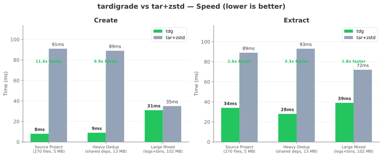
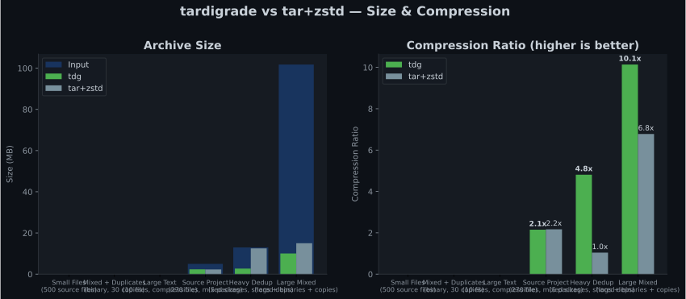
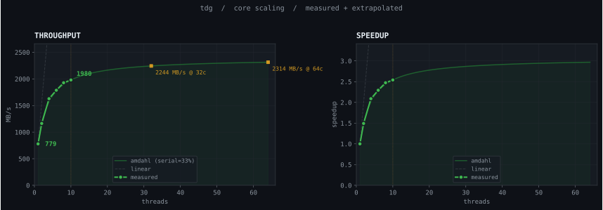

```
                           :+xXXXXXxXXX+
              :+Xxxxx+xxxXXxxx++xx++xXx+xxxx+
            xxxx++++++++++++xxX;;;++++xx+;++;+XX.
          Xxxxxxx++x+;;;;;;;+++xx;;;;;;++X::;;;xXXx
        +xxxx+++++++++;:;;;;;;;+++x:;;;;;;x;:;;;xxx+x
      +Xxxx+++++;++;;;;;.:;;;;;;;;;+::;;;;;+;;;:;xxx;++
     xX++++++;;;;;;;;;;;.:;;;;:;;;;;;.:;;;;;+;;;:+x+;;x
    :X++;;;;;:;;;;;;;;;;: :;;;;;;;;;;.::;;;;;+:::;;x::;X
    xx+;;;;..;;;;;:::;;;: .:;;;;;;;;;.:::;;;;;+:::;x::;x.
   .x+;;;: :;;;;::::;;::: .;;;;;;;;;; .:::;;;;+.::;+..:;+
    x;:;::.;;;::::::::::. :;;;;;::;;; .:::;;;;+:::+x .:x+
    ++x;;::::;:::::::::. .::;;:::::;. .:::;:;;+:.::+;.:;;
     ;: .:..:;::;:::::.  ::;;::::::: ...::::;;+:.:;++..:+
     x;++:;::;::;:::::...;::.::;::+......::::;;..:::+.:;+
    x;;:+;;:::;::;xx++++;;::;;;;;;;.:...::::::;...::+:::;
     ;::::.:;.;:..:;     :;;;;::::+;:;::::::;;;..::;  :
     ;;::::;   ::.        +;;:::::     .::::+    ..
      ..:.                 :;;::         :..
                            . ..
```

# tardigrade

Modern archiving for modern systems. tar, but for 2026.

`11x faster` than tar+zstd on source code | `78% smaller` archives with dedup | `2 GB/s` throughput

[](https://github.com/gnathoi/tardigrade/actions/workflows/ci.yml)

---

## Why

tar is 45 years old. No checksums, no dedup, no seekability, single-threaded compression, and a mess of incompatible extensions. tardigrade is what you'd build if you started from scratch today.

## Features

- **11x faster** — parallel zstd/lz4 compression via rayon, saturates all cores
- **Content-addressed dedup** — identical blocks stored once. Archive 3 copies of `node_modules` and pay for 1
- **BLAKE3 integrity** — every block checksummed and verified on read
- **Encrypted** — ChaCha20-Poly1305 AEAD with passphrase key wrapping
- **Beautiful CLI** — progress bars, throughput, compression ratios, dedup savings
- **.gitignore-aware** — automatically skips `target/`, `node_modules/`, `.git/`
- **Content-defined chunking** — FastCDC dedup works across modified files, not just identical ones
- **Detailed verification** — `tdg verify` checks every block with damage mapping
- **Cross-platform** — Linux, macOS, Windows
- **Reed-Solomon ECC** — `--ecc low|medium|high` erasure coding for data recovery
- **Temporal archives** — `--append` turns a .tg file into a portable Time Machine with `tdg log`
- **Incremental archives** — `--incremental base.tg` stores only new/changed blocks
- **Archive merging** — `tdg merge a.tg b.tg` with automatic cross-archive dedup
- **Volume splitting** — `tdg split --size 4G` and `tdg join` for transport limits
- **tar.zst compatibility** — `tdg extract` auto-detects tar/tar.gz/tar.zst, `tdg convert` migrates to .tg
- **Self-update** — `tdg update` checks GitHub releases and updates in-place with checksum verification

## Install

```bash
curl -fsSL https://raw.githubusercontent.com/gnathoi/tardigrade/main/install.sh | sh
```

Or via Cargo:

```bash
cargo install tardigrade
```

Or download a pre-built binary from [Releases](https://github.com/gnathoi/tardigrade/releases).

## Usage

```bash
# Create an archive
tdg create backup.tg ./my-project

# Extract
tdg extract backup.tg -o ./restored

# List contents
tdg list backup.tg
tdg list -l backup.tg    # detailed view

# Archive info
tdg info backup.tg

# Verify integrity
tdg verify backup.tg

# Encrypted archive
tdg create --encrypt secret.tg ./private-data
tdg extract --decrypt secret.tg -o ./decrypted

# Fast mode (lz4, lower compression, maximum speed)
tdg create --compress lz4 fast.tg ./data

# Maximum compression
tdg create --level 19 small.tg ./data

# Faster compression (default is 9)
tdg create --level 1 quick.tg ./data

# Disable .gitignore filtering
tdg create --no-ignore everything.tg ./repo

# Temporal archives (append new generations)
tdg create backup.tg ./project
tdg create --append backup.tg ./project       # append generation 1
tdg create --append backup.tg ./project       # append generation 2
tdg log backup.tg                             # list all generations
tdg extract --generation 0 backup.tg -o v0    # extract specific generation

# Incremental archives (only store new/changed blocks)
tdg create base.tg ./project
tdg create --incremental base.tg diff.tg ./project
tdg extract --base base.tg diff.tg -o ./restored

# Merge archives
tdg merge a.tg b.tg -o merged.tg

# Split and join volumes
tdg split archive.tg --size 4G
tdg join archive.001.tg archive.002.tg -o archive.tg

# Extract legacy tar archives (auto-detected)
tdg extract legacy.tar.zst -o ./restored
tdg extract legacy.tar.gz -o ./restored

# Convert tar to .tg (with dedup)
tdg convert legacy.tar.zst output.tg

# Reed-Solomon erasure coding
tdg create --ecc low archive.tg ./data        # RS(10,2) ~20% overhead
tdg create --ecc medium archive.tg ./data     # RS(10,4) ~40% overhead
tdg create --ecc high archive.tg ./data       # RS(10,6) ~60% overhead

# Self-update
tdg update                                    # update to latest release
tdg update --check                            # check without installing
```

## Example Output

```
$ tdg create backup.tg ./my-project

  created backup.tg

  21.71 MiB -> 7.66 MiB  2.8x  zstd
  125 files, 11 dirs  127 blocks (123 unique)
  1.95 MiB saved by dedup (4 duplicate blocks eliminated)
  0.03s  806 MB/s
```

```
$ tdg verify backup.tg

  verified backup.tg

  header ok  footer ok  index ok
  blocks 123/123 ok, 0 corrupted
  0.02s
```

```
$ tdg extract backup.tg -o ./restored

  extracted backup.tg -> ./restored

  21.71 MiB  125 files, 11 dirs
  0.02s
```

## Benchmarks

Run locally with `bash bench/run-all.sh` before shipping. Results below from Apple Silicon (M-series, 10 cores, 3 runs averaged).

### Speed



### Size & Compression



### Key Results

Apple Silicon, best of 5 runs, process time only:

| Dataset | tdg create | tar+zstd | Speedup | tdg extract | tar+zstd | Speedup | Size savings |
|---------|-----------|----------|---------|-------------|----------|---------|-------------|
| Source project (5 MB, 270 files) | 8ms | 91ms | **11.4x** | 34ms | 89ms | **2.6x** | ~equal |
| Heavy dedup (13 MB, shared deps) | 9ms | 89ms | **9.9x** | 28ms | 93ms | **3.3x** | **78% smaller** |
| Large mixed (94 MB, logs+bins) | 31ms | 35ms | **1.1x** | 39ms | 72ms | **1.8x** | **29% smaller** |

**Where tardigrade wins big:** Source code, projects with shared dependencies, anything with duplicate content. Parallel compression + dedup + skipping FastCDC for small files makes tardigrade 10x faster for typical developer workloads.

**Where it's equal:** Large unique binary data. Both tools are I/O bound at that point.

Run benchmarks yourself: `bash bench/run-all.sh`

### Core Scaling

tardigrade uses rayon for parallel compression and hashing. More cores = more throughput, up to the I/O and serial bottleneck. Measured on Apple Silicon, extrapolated using Amdahl's law:



At 10 cores: ~2 GB/s. Predicted at 32 cores: ~2.2 GB/s. The serial fraction (~34%) is the single-threaded dedup lookup + sequential write pass.

## Archive Format (.tg)

The `.tg` format is designed from scratch for modern use:

```
[ArchiveHeader 16B] [KeyEncap?] [Block0] [Block1] ... [BlockN] [Index] [RedundantIndex] [Footer 76B]
```

- **ArchiveHeader**: magic `TRDG`, version, flags (encrypted, erasure-coded, append-only)
- **Blocks**: 48-byte header (BLAKE3 hash, sizes, codec, CRC32) + compressed payload
- **Index**: msgpack-encoded file tree, zstd compressed, stored twice for redundancy
- **Footer**: index offsets, block count, Merkle root hash, prev-footer pointer

Content-defined chunking (FastCDC, 64KB-1MB target 256KB) splits files at content boundaries. Blocks are content-addressed by BLAKE3 hash. Identical blocks across files are stored once.

### Encryption

When `--encrypt` is used:
- Archive key: random 256-bit symmetric key
- Block encryption: ChaCha20-Poly1305 AEAD, nonce derived from content hash
- Key wrapping: passphrase -> BLAKE3 KDF -> wrapping key -> encrypted archive key
- Dedup automatically disabled (prevents hash-based content inference)

## What's Next

- [x] Reed-Solomon erasure coding (`--ecc low|medium|high`)
- [x] Temporal/append-only archives (`tdg log`, `--append`, `--generation N`)
- [x] Incremental archives (`--incremental base.tg`)
- [x] Archive merging (`tdg merge a.tg b.tg`)
- [x] Volume splitting (`tdg split --size 4G`, `tdg join`)
- [x] tar.zst read compatibility (`tdg extract`, `tdg convert`)
- [ ] FUSE mounting (`tdg mount archive.tg /mnt`)
- [ ] `tdg repair` — reconstruct corrupted blocks using ECC parity
- [ ] `tdg diff archive.tg@1 archive.tg@3` — diff between temporal generations

## Architecture

```
CLI (clap)
  |
  +-- archive.rs      walk -> chunk (FastCDC) -> dedup -> compress -> write
  +-- extract.rs      read footer -> parse index -> decompress -> verify -> write
  +-- verify.rs       full integrity check with damage mapping
  |
  +-- chunk.rs        FastCDC content-defined chunking
  +-- dedup.rs        content-addressed block store
  +-- compress.rs     zstd / lz4 / none
  +-- encrypt.rs      ChaCha20-Poly1305 + key encapsulation
  +-- erasure.rs      Reed-Solomon erasure coding (RS 10,2/4/6)
  +-- format.rs       wire format types (the foundation)
  +-- hash.rs         BLAKE3 + Merkle tree
  +-- index.rs        msgpack + zstd index serialization
  +-- metadata.rs     POSIX metadata + path traversal protection
  +-- progress.rs     indicatif progress bars
  |
  +-- temporal.rs     append-only archives + generation management
  +-- incremental.rs  differential archives against a base
  +-- merge.rs        content-addressed archive merging
  +-- split.rs        volume splitting + reassembly
  +-- compat.rs       tar/tar.gz/tar.zst read + conversion
  +-- update.rs       self-update via GitHub releases
```

## Claude Code Skill

tardigrade ships with a [Claude Code](https://claude.ai/code) skill that teaches Claude the full CLI, format, and common workflows. To use it, add tardigrade as a skill dependency:

```bash
# In your project's .claude/settings.json or ~/.claude/settings.json
# Add to the skills array:
# "skills": ["path/to/tardigrade/tardigrade-skill"]
```

Once installed, Claude will automatically suggest `tdg` commands when you're archiving, backing up, compressing, or working with `.tg` files.

## License

Apache-2.0
